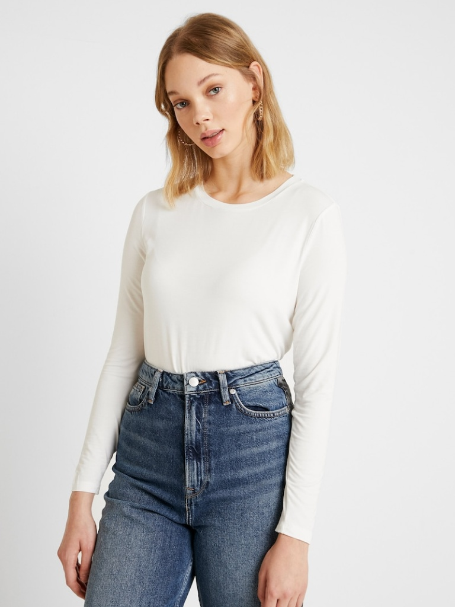
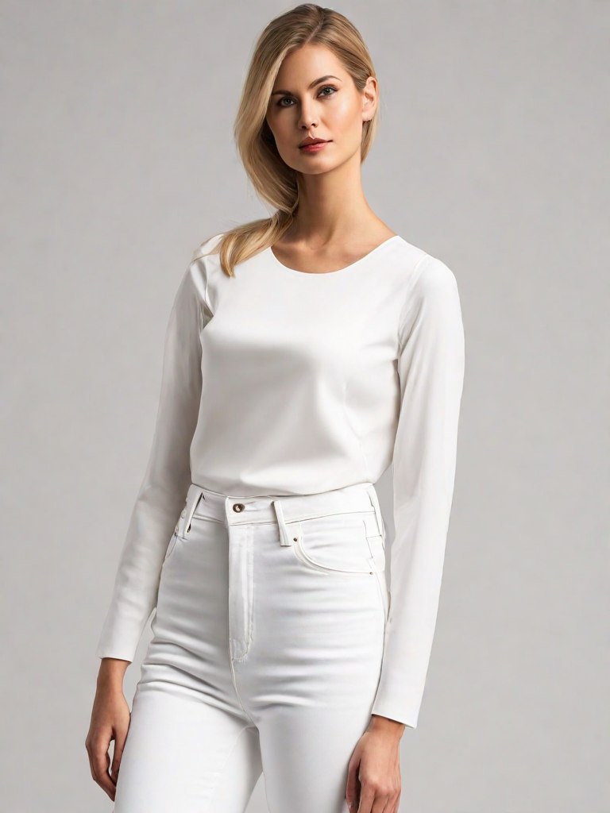
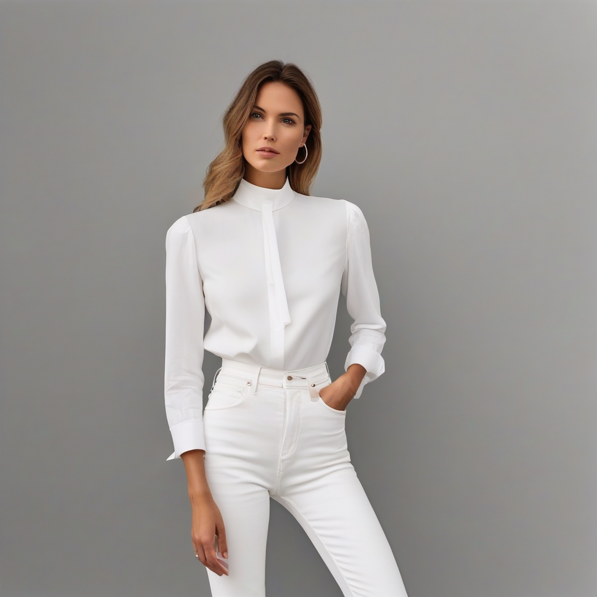
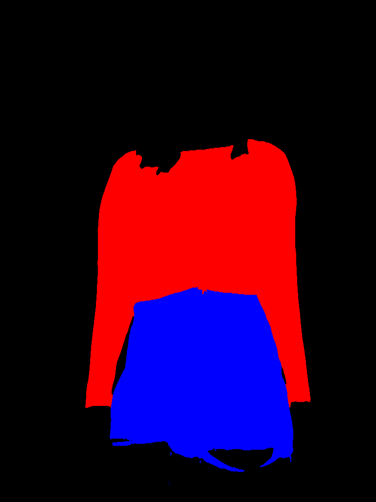
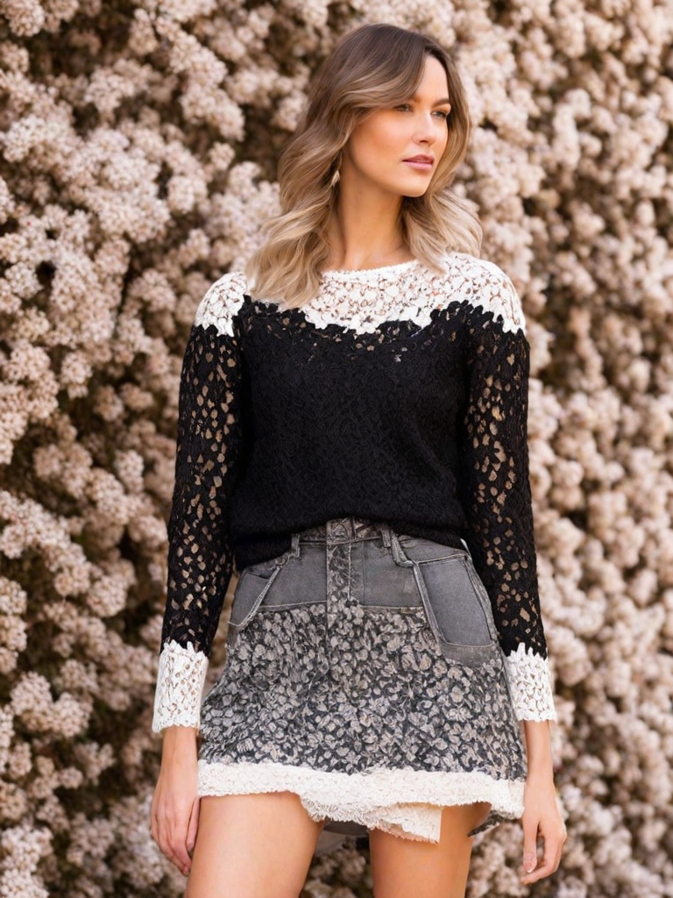
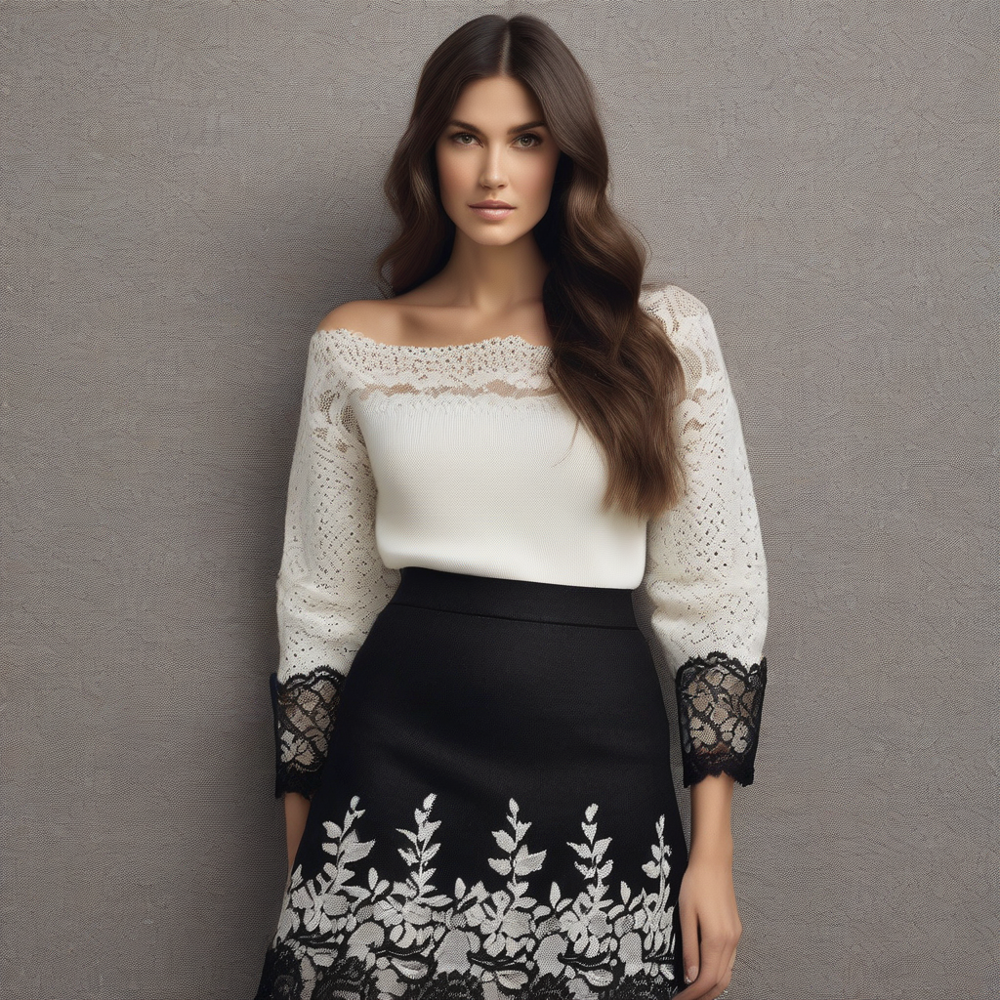
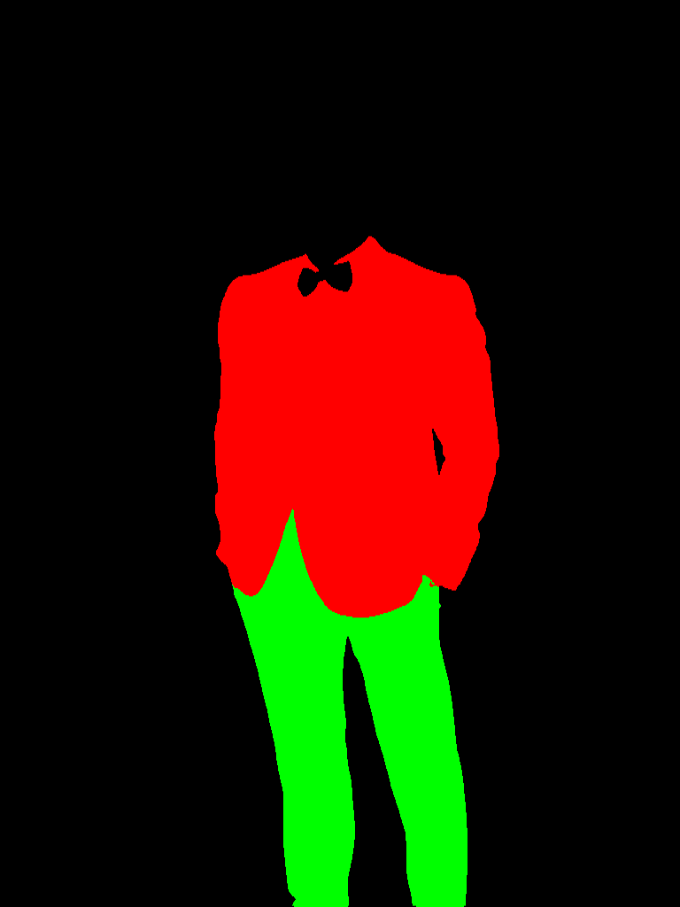
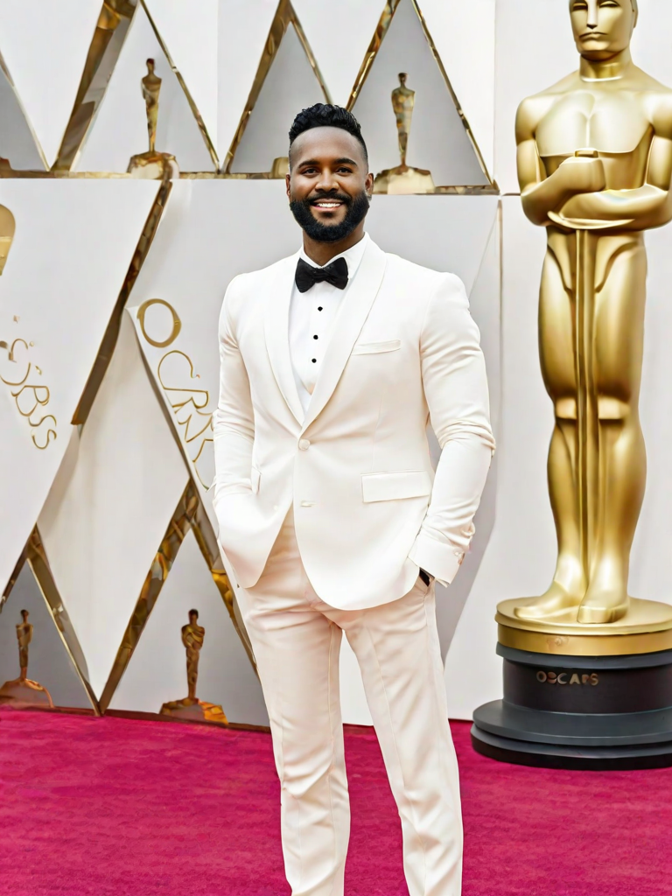
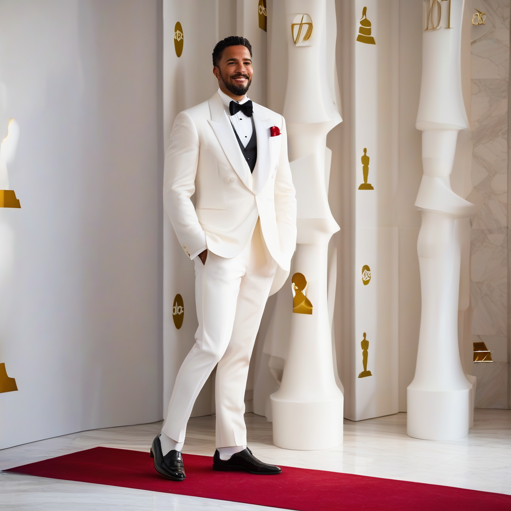

# Fashion ControlNet SDXL #


[](https://opensource.org/licenses/MIT)
[](https://huggingface.co/spaces/dragynir/fashion_controlnet)
[](https://colab.research.google.com/drive/1-SbSkGveuC7ZSohz5nyMib9Iot_5os4c?usp=sharing)


This repo contains training code, inference code and pre-trained model for 
an image generation pipeline based on [SDXL](https://huggingface.co/stabilityai/stable-diffusion-xl-base-1.0) conditioned on [Clothes Segmentation](https://github.com/levindabhi/cloth-segmentation) using U2NET.


<p float="left">
  
  
  
</p>


| Input image                                | Mask                                                    | Generated                                                    |
|--------------------------------------------|---------------------------------------------------------|--------------------------------------------------------------|
|  |  |  |

Prompt: `a woman wearing a white top and jeans with a high waist and a high rise heming hem is standing in front of a white background, Christian Hilfgott Brand, waist up, a photocopy, neoclassicism, ultra quality, sharp focus
`

# Inference

You can find inference script in [inference.py](src/inference.py). Run it with prepared mask or with image to extract mask first.

Also, check out huggingface space [](https://huggingface.co/spaces/dragynir/fashion_controlnet)
and google colab [](https://colab.research.google.com/drive/1-SbSkGveuC7ZSohz5nyMib9Iot_5os4c?usp=sharing)

You can clone hugging face space, or download it into your machine with gpu, install requirements.txt and run locally.

# Weights

Trained ControlNet weights for fashion are available on huggingface [](https://huggingface.co/spaces/dragynir/fashion_controlnet/tree/main/weights) (5 GB)

# Technical details

* **Condition** : Clothes Segmentation mask, see details in [UNET repo](https://github.com/levindabhi/cloth-segmentation)

* **Image Dataset** : ControlNet was trained on 45k images [iMaterialist (Fashion) 2019 at FGVC6](https://www.kaggle.com/c/imaterialist-fashion-2019-FGVC6/data) dataset. 
For conditioning, i use 3 categories (upper body, lower body and full body).  Inspect [dataset.py](src/dataset.py) for better understanding.

* **Image Caption** : Captions were created with [clip-interrogator](https://github.com/pharmapsychotic/clip-interrogator)
The CLIP Interrogator is a prompt engineering tool that combines OpenAI's CLIP and Salesforce's BLIP to optimize text prompts to match a given image.
You can create your own caption with [clip_caption.py](src/clip_caption.py)

* **Control Net**:  Training script is based on diffusers script [train_controlnet_sdxl.py](https://github.com/huggingface/diffusers/tree/main/examples/controlnet)
You can find changed configuration parameters at [config.py](src/config.py).

# Major Changes in Training/Inference

1) SDXL's VAE is known to suffer from numerical instability issues.
So i used [this one](https://huggingface.co/madebyollin/sdxl-vae-fp16-fix) as recommended in diffusers README_sdxl.md.
I encountered NaNs during fp16 training with the default vae.

2) I added the `compute_adaptive_hw` function, which prepares `crop_top_left` and `original_image_size` parameters for passing into Unet.
This adjustment ensures that ControlNet training matches the original SDXL training, see Micro-Conditioning in original [SDXL paper](https://arxiv.org/pdf/2307.01952.pdf).

3) I implemented adaptive image resizing to maintain the original mask's aspect ratio during the inference process.


# Training

### Installation

- Python >= 3.9
- `pip install -r requirements.txt`


### Data Preparation

1) Download and extract [imaterialist-fashion-2019](https://www.kaggle.com/c/imaterialist-fashion-2019-FGVC6/data) dataset to [data/](data) folder.
2) Run [clip_caption.py](src/clip_caption.py) to extract prompts from images or use precomputed from [data/](data) folder.
3) Then run [dataset.py](src/dataset.py) to generate and save masks in `.png` format to disc.
4) Validation masks are already in validation [folder](data/validation).

#### The final directory structure should be

    .data/
    ├── train/                    # train images   
    │   ├── image1.jpg          
    │   ├── image2.jpg
    ├── train_condition_images/  # train images masks
    │   ├── image1.png          
    │   ├── image2.png
    ├── test/   
    ├── validation/   
    ├── train.csv
    ├── caption.csv              # caption created by clip_caption.py
    └── label_descriptions.json

### Run training

```bash
accelerate launch src/train_controlnet_sdxl.py
```


### Compare conditioned and non-conditioned generations using the same seed.

| Mask                                                    | Condition                                                    | No condition                                                    |
|---------------------------------------------------------|--------------------------------------------------------------|-----------------------------------------------------------------|
|  |  |  |
|  |  |  |
|  |  |  |


# Acknowledgements
- Pretarined U2net model is from [u2net repo](https://github.com/levindabhi/cloth-segmentation). Thanks to levindabhi for amazing repo.


# TODO Real TODO list (training 1024, training as SDXL)
- [x] прокинуть параметры в демке (seed и т д)
- [x] добавить caption.csv в data/ - в этом репосе т к в huggingface нельзя
- [x] сделать colab ноутбук https://colab.research.google.com/drive/1-SbSkGveuC7ZSohz5nyMib9Iot_5os4c?usp=sharing
- [x] прогнать скрипт на 100-200 примеров генерации (prompt, generated with condition, generated without condition(original sdxl))
  - https://huggingface.co/stabilityai/stable-diffusion-xl-base-1.0 как запускать без condition
  - добавить примеры в Readme.md
- [x] закончить пункт Run training
- [x] вставить condition/ no condition примеры
- - [x] обновить видео (пример входной: https://lexica.art/prompt/adfeb3a7-1e74-4809-a681-a8555a7b5d82)
  - [ ] сохранил пока локально - надо будет его отредачить - чтобы было короткое
- [x] доделать colab - прокинуть параметр share=True в app.py чтобы можно было его запустить, открыть доступ к space
- [x] потестить колаб на открытой репе
- [x] Проверить что все ссылки в Readme.md работают!
- [x] Check English spelling
- [x] Проставить цитирование (ссылки на код)
- [ ] Выровнять таблицу с изображениями
- [ ] Записать видос
- [ ] пробую memory effictient attention
- [ ] обучить более сильную модель
- [ ] обновить под нову модель, переписать скрипт последнего обучения в этой репе


# TODO app

- [x] научиться записывать демку (научился Screencastify - поставил плагин в гугл)
- [x] добавить adaptive resize
- [x] Переписать под RGB input с новой моделью (уберу так плохой код в том числе)
- [x] прокинуть параметры в демке (seed и т д),
- [x] добавить negative prompt
- [x] adaptive resize размеры
- [x] пофиксить загрузку маски
- [x] подобрать нормальные промпты к примерам, добавить negative prompt (https://blog.segmind.com/prompt-guide-for-stable-diffusion-xl-crafting-textual-descriptions-for-image-generation/)
- [x] удалить ненужные веса
- [x] небольшой рефач - dark theme - можно попробовать
- [x] проверка ссылок
- [x] залить версию в main  
- [x] разобраться с выставлением device в пайплайн
- [x] настроить запуск в hugging space

