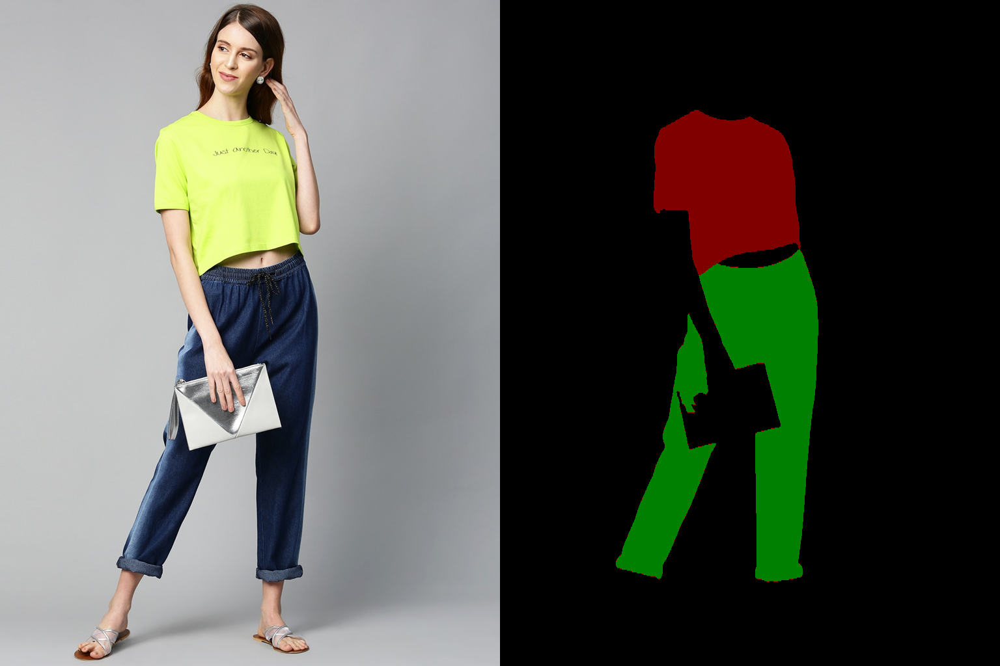

# Fashion ControlNet SDXL #

TODO: hugginface space
TODO: colab using hugging face

This repo contains training code, inference code and pre-trained model for 
image generation pipeline based on [SDXL](https://huggingface.co/stabilityai/stable-diffusion-xl-base-1.0) conditioned on [Clothes Segmentation](https://github.com/levindabhi/cloth-segmentation) using U2NET.

assets/demo.webm

Example image with extracted mask

# Inference

You can find inference script in [inference.py](src/inference.py). Run it with prepared mask or with image to extract mask first.

Also, check out huggingface space app [TODO space](space). And colab inference script [TODO colab](colab)

# Weights

Trained ControlNet weights for fashion is available on huggingface [space](https://huggingface.co/spaces/dragynir/fashion_controlnet/tree/main/weights) (5 GB)
TODO - add two versions of model

# Technical details

* **Condition** : Clothes Segmentation mask, see details in [UNET repo](https://github.com/levindabhi/cloth-segmentation)

* **Image Dataset** : ControlNet was trained on 45k images [iMaterialist (Fashion) 2019 at FGVC6](https://www.kaggle.com/c/imaterialist-fashion-2019-FGVC6/data) dataset. 
For condition i use 3 categories (upper body, lower body and full body).  Inspect [dataset.py](examples/controlnet/dataset.py) for better understanding.

* **Image Caption** : Captions were created with [clip-interrogator](https://github.com/pharmapsychotic/clip-interrogator)
The CLIP Interrogator is a prompt engineering tool that combines OpenAI's CLIP and Salesforce's BLIP to optimize text prompts to match a given image.
You can create your own caption with [clip_caption.py](examples/controlnet/clip_caption.py)

* **Control Net**:  Training script is based on diffusers script [train_controlnet_sdxl.py](https://github.com/huggingface/diffusers/tree/main/examples/controlnet)
You can find changed configuration parameters at [config.py](src/config.py).

# Training

### Installation

- Python >= 3.9
- `pip install -r requirements.txt`

### Data Preparation

1) Download and extract [imaterialist-fashion-2019](https://www.kaggle.com/c/imaterialist-fashion-2019-FGVC6/data) dataset to [data/](data) folder.
2) Run [clip_caption.py](examples/controlnet/clip_caption.py) to extract prompts from images or use precomputed [file: TODO upload caption.csv to hugginface data/ folder]().
3) Then run [dataset.py](src/dataset.py) to generate and save mask in `.png` format to disc.
4) Validation masks are already in validation [folder](data/validation) TODO put some masks here.

#### The final directory structure should be

    .data/
    ├── train/                   # train images   
    │   ├── image1.jpg          
    │   ├── image2.jpg
    ├── train_condition_images/  # train images masks
    │   ├── image1.png          
    │   ├── image2.png
    ├── test/   
    ├── validation/   
    ├── train.csv
    ├── caption.csv              # caption created by clip_caption.py
    └── label_descriptions.json

# Better VAE

SDXL's VAE is known to suffer from numerical instability issues.
You need to specify the location of a better VAE ( [this one](https://huggingface.co/madebyollin/sdxl-vae-fp16-fix)).

Download `diffusion_pytorch_model.bin` and `config.json` files and put them to `./weights/better_vae folder`.

# TODO Real TODO list (training 1024, training as SDXL)

- [ ] ...
- [ ] Check English spelling

